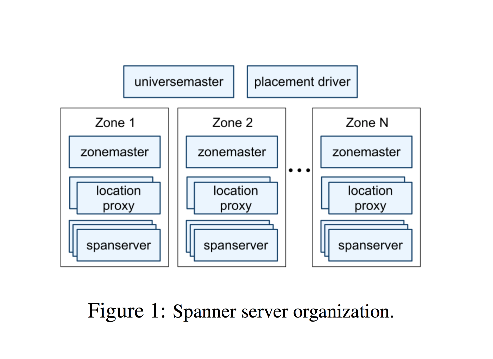
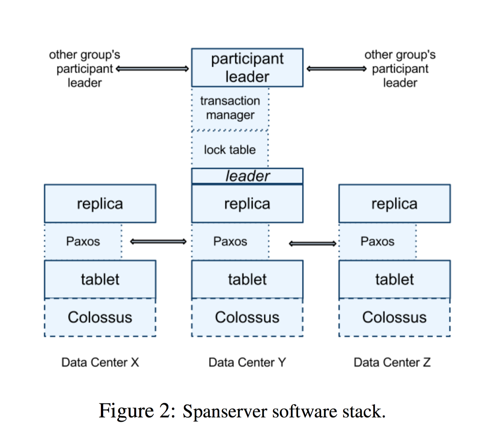

# Spanner: Google’s Globally-Distributed Database, OSDI 2012

## 考点
1. SQL, noSQL, newSQL演化过程
2. Spanner技术细节
3. 课后题

## SQL -> noSQL -> newSQL 
- [为什么](http://dataconomy.com/sql-vs-nosql-vs-newsql-finding-the-right-solution/)

    SQL：使用广泛，标准统一，技术支持丰富，保证ACID；扩展性差，过于通用以至性能提升受限，调试复杂;

    noSQL：最终一致性使得availability很好，扩展性好，半结构化数据的设计适于动态调整schema；代价是ACID的弱化;

    newSQL：更容易实现强一致性，事务支持，支持SQL语义和工具，使用NoSQL风格的集群架构而提供传统的数据和查询模型；通用性还是没SQL好，并不支持所有传统SQL工具。

## Spanner
### **1. Overview**
#### 现状

不适用于BigTable的应用：“complex, evolving schemas”，或要求所有副本保持强一致性。

Megastore：poor write throughput

#### 区别于BigTable

- 从简单的key-value store加强到temporal multi-version database；
- 数据以半关系型的table组织；
- 支持txn语义；
- 支持SQL查询。

#### 两个特性
- 其上的应用程序能够动态配置replication，达到负载均衡和降低延迟；
- External Consistency：分布式事务系统中，txn1的commit先于txn2的start，那么txn1的提交时间应小于txn2的提交时间。即能看见txn2的时候一定要能看见txn1。

### **2. Implementation**
#### 系统架构

（从宏观到微观）

Universe：Spanner的整个部署

- universe master：单例，维护所有zones；
- placement driver：单例，负责在zones之间迁移数据。
- zone：等同于其下BigTable的部署节点，是管理配置的单位，也是物理隔离的单位；

Zone内部：

- zonemaster：每个zone都有一个，负责将数据分配给当前zone的spanserver；
- location proxy：每个zone有多个，为client提供定位到需要的SpanServer的服务；
- spanserver：每个zone有成百上千个，负责为client提供数据服务；

核心设计就在于span server。

#### Spanserver架构

先不急着看图，顺着前文捋清楚层次架构关系。每个span server有如下组成部分：

- tablets：存数据的最小单位，概念和BigTable的tablet相近（一个tablet往往有多个备份副本，会存在其他zone的span server上）；
- Paxos state machine：每个span server维护一个用来选举（使用场景：当需要修改本地某个tablet时，由于需要同时修改其他span server上的副本，此时用每个span server上的Paxos状态机来处理一致性的问题(选出leader等)），tablet副本的集合组成Paxos group；写请求由Paxos leader负责，读请求由任意足够up-to-date的tablet所在span server执行都行；
- lock table：（单Paxos group中选为leader可用）标示该Paxos group中对应数据的上锁情况；
- txn mngr：（多group leaders中选为coordinator leader可用）当要执行的txn跨多个Paxos group时，需要对这些groups leader进行再选举，选举出来coordinator leader & non-coordinator-participant leader。前者使用txn mngr来协调这个txn（协调方法：txn mngr对其下管理的Paxos leaders执行2PL，即“尝试拿锁-修改并释放”）。

然后我们就能看懂下图了：

#### Directories
    
dir是数据放置的单元，其下所有数据有一致的备份设置

#### Data Model
    
基于directory-bucketed key-value mappings，主键作为key，其他作为value

### **3. TrueTime**
#### API

TT.now()：返回一个时间段[earliest, latest]，保证被调用的一刻，所有spanserver的本地时间都处在这个范围内；

TT.after(t), TT.before(t)：检查是否所有spanserver都经历了t；或都还没有经历t。

#### TrueTime实现方式
    
硬件设备：GPS和原子钟。

每个datacenter中有一些time master机器，每个都运行timeslave后台；大多数使用GPS其他用原子钟。特点如下：

- GPS互相同步但易受干扰；
- 原子钟相对稳定但一段时间不同步会导致TT.now()时间段变大（原子钟的频率会有微小差异）。

### **4. Concurrency Control**

Clients通过location proxy来定位spanserver，将请求交由该spanserver处理。

#### 主要的txn类别
- read-write txn: 普通的读写txn；
- read-only txn: 确定只读的txn。不拿锁，不block接下来的read-write txn，选择足够up-to-date的replica执行都行；
- snapshot reads: 读历史数据（或者说，数据在某个时间的版本）的txn。不拿锁，选择足够up-to-date的replica执行都行（简单，没讲）。

#### 4.1 Read-Write Txns

1. （**spanserver执行部分**）对要读的数据，向对应的group leader拿读锁（如果拿不到就放弃，重新拿，即wound-wait）；
2. 执行本地读写（外部不可见）；
3. 修改完成，开始2PC。选择coordinator group，将修改发送给coordinator leader和non-coordinator-participant leader；
4. （**每个non-coordinator-participant leader执行部分**）收到txn修改内容后，选择本地最新成功的txn commit timestamp作为"prepare timestamp"返回给coordinator leader；
5. （**coordinator leader执行部分**）获得每个leader相应的写锁；
6. 等待所有participant leader的"*prepare timestamps*"，选择最大的"**s**"。再将**s**与TT.now().latest和本地最新成果的txn commit timestamp比较，取最大的作为commit timestamp，赋值给"**s**"；
7. 持续调用TrueTime获取interval，等待s < TT.now().earliest，即TT.after(s)，确保所有在s之前的txn都全局生效；
8. 以s为commit timestamp提交当前txn，并反馈client；
9. 释放锁。

说明：第六步中，实际上，就是想拿到一个timestamp **s**作为当前txn的commit timestamp。由于txn的顺序是遵循他们的commit timestamp，这个**s**就要保证大于之前所有txn commit timestamp。所以第七步等待花的时间就是用来确保所有机器的时间都“经历”了这些“之前的”txn的commit timestamp时间点，这些“之前的”txn此刻确定全局可见。

#### 4.2 Read-Only Txns

首先，提取所有会被读到的key作为scope，然后分类讨论：

1. 如果scope都落在一个Paxos group：将这个RO txn发送给group leader；leader调用LastTS()获取本spanserver最近一次的write commit timestamp作为RO txn的timestamp并执行；
2. 如果scope跨多个Paxos groups：读取TT.now().latest作为当前RO txn的timestamp并执行。

说明：以上两种处理都能保证这次读在所有已全局生效的写之后

#### 4.3 Schema-Change Txns

通过TT，选取未来的timestamp作为该txn提交时间，记为s；所有在s之前的txn正常执行；在s之后的被blocked，直到TT.after(s)==true再执行。

## 课后题（仅供参考）

1. What is external consistency? What’s the difference between external consistency and serializability?

    Definition: if a transaction T1 commits before another transaction T2 starts, then T1’s commit timestamp is smaller than T2’s.

    E.C.强调的是，每个txn在系统中生效的时间点和他们的commit timestamp保持一致，即对于commit timestamp t1<t2，则所有相关server看到的生效顺序也会是先T1后T2；

    而Serialization强调的是，txn之间**要有**执行的先后顺序，但不能保证在分布式里所有server上看到的顺序都是一致的（可能会在某server上看到的生效顺序和每个txn设定的全局顺序不一致。限制松一点）。

    【有不同意见可附在这下面，标出姓名及参考即可】

2. How does Spanner achieve the external consistency?

    首先，Spanner通过巧妙的设计与同步得到TrueTime API，调用时能够获得一个较精确的interval，能保证绝对时间在这个范围内；

    然后，所有需要全局同步的txn需要进行两步提交（2PC: prepare-commit）：在prepare阶段调用TrueTime.now()，将这个txn的commit timestamp（记为s）设置为TrueTime.now().latest，从而保证s晚于当前绝对时间之前的所有txn提交时间；然后等待一段时间直到TrueTime.after(s)为true，即此时所有先于s提交的txn都全局同步完成了，再进行commit阶段提交这个txn。
    这样，保证了当前txn提交的timestamp一定大于之前的所有txn，且之前的所有txn都全局可见。

3. What will happen if the TrueTime assumption is violated? How the authors argue that TrueTime assumption should be correct?

    可能导致txn取得的commit timestamp会小于绝对时间在这之前提交的txn，使得实际发生在之后的txn可见时，之前的txn可能不可见。违反external consistency。

    “经过测试，我们的TrueTime足够精确，出错的概率非常小。”
