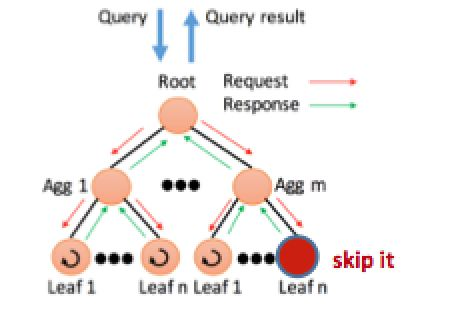

### 考点
>理解latency 在scale增大时更加严重（参见 课前题目参考答案 1）

>哪些策略能在大规模下减轻 tail 的  latency (参见 下方 容延技巧)

### 概要和重点
latency 存在在 CPU和cache间、网络上的客户端和服务器间、应用和disk间、任何系统工作的地方。想象client向server发送请求，迟迟无响应，表明解决latency的重要性。

*降低latency的体现：cache（CPU 和 main memory）、In-memory computation*

####latency的出现场景
  大数据（关系型->复杂，非结构化）中的查询：Online Search (OLS) 交互式查询和访问数据
  
  数据横跨千万台服务器
  
  Latency critical 应用 ( 双十一购物online shopping;
  virtual reality instruments;
  self- driving car) 

####latency出现原因（4 个 latency sources）

- 资源竞争(机器被多应用共享)
- 倾斜的访问模式（一些纪录更容易被访问到）、
- 排队延迟（队头慢影响队尾，队列延迟被放大）、
- 后台活动（守护进程被周期性调度）

####降低组件变量延迟（从source的角度）

- 区分服务类型和高级队列
- 减少队首阻塞
- 管理后台活动（同步多台机器上的后台活动）

###延迟被范围放大（Latency Amplified By Scale）
Even rare performance hiccups affect a significant fraction of all requests in the large-scale settings.

具体参见课前题目参考答案1

### 容延技巧（Tail-tolerant techniques） 
 
 － Within request short-term adaptations（几十毫秒级的请求内短期适应）
 
 － Cross request long-term adaptations（几十秒到分钟级的跨请求长期适应）
 
 （以上两种技巧的具体策略如下所示）

#### **－ Within request short-term adaptations（几十毫秒级的请求内短期适应）**

**1.Hedged requests(对冲请求)
**
  
        把同样的request发布给多台有data replica的servers，哪个server 响应最快，就使用这个响应结果。
        （We term such requests “hedged requests” because a client first sends one request to the replica 
        believed to be the most appropriate, but then falls back on sending a secondary request after some 
        brief delay. The client cancels remaining outstanding requests once the first result is received.）
  
       *改进版：延迟发送第二次请求（defer sending a secondary request until the first  request has been outstanding
       for more than the 95th-percentile expected latency for this class of requests.）*
  
       弱点：hedged-requests technique 中可能多台服务器可能不必要地执行相同请求。  

**2.Tied request（关联请求）（基于hedged request的优化）**

       不是选择把request发送给哪台 server，而是直接把请求同时放置在多台服务器的服务队列上，允许服务器彼此交流这个请求的服务更新状态。 把允许服务器执行跨服务器状态更新的请求称为“tied requests.”。最简单的形式就是在发送一个request的同时，绑定发送给其他服务器的编号tag。当一个请求开始执行的时候，就可通过tag告知其他服务器中止执行该请求，其他服务器的服务队列中如果还有这个request，则直接将其移除或降低优先级。
     
       弱点：request在servers的服务队列中延迟 
  
       *改进版：先探查remote queues, 把请求发送给最低负载的server
       弱点：load levels can change between probe and request time；请求服务时间难以估计；clients can create hot spots by 
       all picking the same (least-loaded) server.*

#### **－ Cross request long-term adaptations（几十秒到分钟级的跨请求长期适应）**

**1.Micro-partitions（微划分）**

       产生远多于现存机器数的细小的分区，进行动态分配partitions，保证这些机器上的负载均衡，例如
    （Tablets in BigTable，typically each machine managing 20 ~ 1,000 tablets），也提升了容错恢复速度；virtual server partition, virtual processor partition）
    
**2.Selective Replication（选择性复制）（微划分的增强版）**

       预测可能的负载不均衡，创造额外的复制品（例如Google’s web search system will make additional copies of popular and important documents in multiple micro-partitions）

**3.Latency-induced Probation（延迟引导的探查）**

       观察不同机器，暂时排除特别慢的机器，对excluded servers继续发送shadow请求，一旦发现问题减缓，把这些排除掉的机器再合并进来。
        
       弱点（违反直觉的）：在高负载的情况下，从一个live system中移除一个server实际上提高了延迟
       

### 大型信息检索系统

- 速度是关键的质量度量标准（Returning good results quickly is better than returning the best results slowly）

            
- 处理不精确结果的技巧  

    — Good-enough schemes（够好就行）：只要有足够数量的sub servers返回结果即可，跳过不必要的子系统提高响应能力（分布式环境下）
                    
   
   
    — Canary requests(金丝雀请求)：在向所有子服务器发送请求之前，先找一两个测试一下，如成功才发送。（Provide additional safety；Slightly increase in latency：Wait for single or two servers to respond is much less variable than in the large fan-out settings）

### Hardware Trends and Their Effects

- Trends that further **hurt the latency**

          — Variability at the hardware level is likely to be higher
          — Device heterogeneity
          — Increasing system scale

- Trends that help **mitigate the latency**

         — Higher bisection bandwidth
         — Lower per-message overheads
         
### Conslusion

- Even rare performance hiccups affect a significant fraction of all requests in large-scale distributed systems
- Eliminating all sources of latency variability in large-scale systems is impractical, especially in shared environments
- Using an approach analogous to fault-tolerant computing, tail-tolerant software techniques form a predictable whole out of less-predictable parts
                            
### 课前题目参考答案

* ***Why latency variability is amplified by scale?***

   当前在大型的在线服务中减少延迟的一个普遍的技巧就是分配子操作在多台不同的机器上，使其并行执行，并保证每个子操作和它使用的那部分数据会放置在一处。由root把请求fan out到众多的leaf servers，最后再通过request-distribution tree把来自leaf servers的响应merge起来。这些子操作必须都在一个严格的deadline之内完成，来保证service可响应。
   
   然而，在大型分布式环境下，一个组件的延迟在service level就会被放大。如上所述，若每个单独的组件延迟很短时间，把他们整合起来的延迟时间就可能会很长。尤其是一些request的相应必须收集并行的、众多的、带有微小延迟的servers的response的时候，集合起来的性能延迟将是不可忽视的。
 
* ***Please briefly outline some effective tail-tolerant techniques.***

  参见  上方  容延技巧

* ***Why tolerating latency variability for write operations is easier?***
  
  － The scale of latency-critical modifications in these services in generally small
  
  － Updates can often performed off the critical path, after responding to user
  
  － Many services can tolerate inconsistent update models
  
  － Services require the consistent updates usually go through Paxos, which is inherently tail-tolerant
