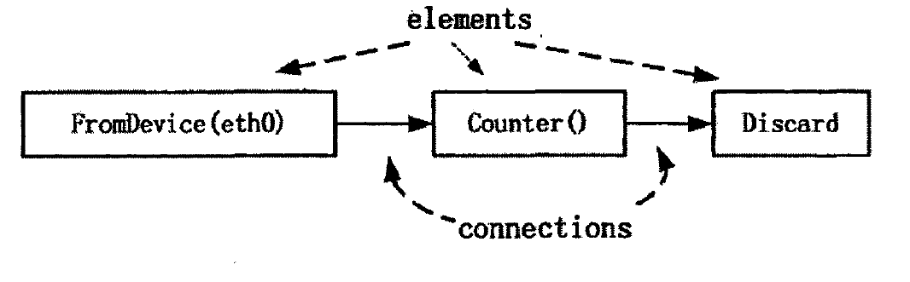
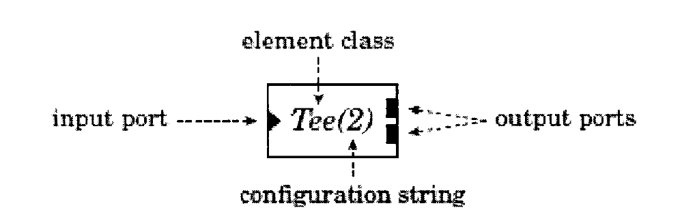

#The Click Modular Router

##助教提供的考点
1. 为什么要提出这个技术？与传统的区别？
	Unfortunately, most routers have closed, static, and inflexible designs. 现有的大多数路由器的设计都是封闭的，静态的和刻板的。
    Network administrators may be able to turn router functions on or off, but they cannot easily specify or even identify the interactions of different functions.
    网络管理员很难指定甚至定义不同functions之间的交互。
    Furthermore, network administrators and third  party software vendors cannot easily implement new  functions.
    而且，要实现新的functions很难。
    与传统的区别：（1）灵活:很容易添加新的功能 （2），模块化：通过组合元素来实现功能； （3）， Open：允许开发者添加元素（Elements);（4），效率：与硬件性能相差不大。

2. Pull和Push
	push和pull是Click里elements直接的两种连接方式。
	Push是从源Element到下游的元素，通过事件触发，比如有包到达。在Push连接方式里，上游的元素会提交一个包到下游的元素；
    Pull是从目的地元素到上游元素。在Pull的连接方式里，是下游的元素发送包请求到上游的元素。当输出接口准备好发包时，会开始一个pull过程：该过程会一直向后遍历图直到遇到某个元素‘吐出’一个包。

3. 包调度
	在Click里，调度器就是一个有着多个输入端口，一个输出端口的pull element，
	并通过一定的调度策略来决定从这多个input进来的包应该如何共享这个Output。
	在论文里提到click实现了两个调度器：Round-Robin Sched 和 PrioSched (Priority Scheduler)。 Round-Robin Sched 就是对input进行轮询。 PrioSched (Priority Scheduler)就是每次都从第一个input开始pull packets。
	
4. Dropping Policies
	Click通过队列元素来实现一个简单的Dropping策略， 也就是当包数目超过配置的最大长度时，这些包都会被扔掉。
	论文提到的Dropping策略：（1），RED：Random Early Detection。 该Element以下游的最近的队列长度作为Dropping的依据。(2), RED over multiple queues: 如果RED的下游有多个队列，那就将这些队列的长度都加起来作为Dropping的依据；（3），weight RED: 每个包根据它的优先级有不同的Drop的概率。
	
5. NFV:Network Function Virtualization
   Network Functions(Middleboxes): Firewall, IDS, DNS。网络功能虚拟化就是虚拟化这些网络功能，也就是通过软件模拟实现这些网络功能。
   或者说是：运行在云设施的网络服务。
    NFV目标：（1）省钱：使用更便宜的商业服务器来实现网络功能；减少专有硬件的使用，从而降低能耗，并且能够方便地维护。（2）赚钱：加速网络服务部署；
    网络基础设施作为服务；

##提纲

Click是一个能够灵活配置的软件路由结构。它是由一系列包处理模块(被称为组件)按照特定方式组合而成。组件是click中最小的功能单元，它只实现最简单最单一的功能如排队、调度、分类、复制等，稍微复杂的功能可以用若干个组件复合而成。一个路由配置是一个有向图，组件位于顶点，数据包沿着有向图的边传输，如图1所示。Click的一些特性如下拉连接、基于设备的上下文，能增强组的功能，使配置更容易更利于编写。一个click组件代表着一个最基本的功能单元，例如减少一个IP包的生存时间域，而不是实现一个复杂的功能如IP路由。用户通过选择组件并连接它们来实现不同的路由功能。在一个运行的路由器中，每一个组件是一个属性为私有的C++对象，连接用一个指向组件对象的指针代替，通过一个简单的虚拟函数实现一个数据包沿着一个方向连接。

 
                               图 1 一个click组件连接图

 Click系统用C++语言已经封装了很多的组件，每一个组件都实现一个简单的功能。我们要做的工作就是通过click配置语言对这些组件进行连接，从而完成特定的路由功能，因此，click语言对于实现路由功能是特别方便的。Click配置语言由两个部分构成:声明组件和连接。它的语法非常简单易懂，例如图1的配置可以写成如下形式 
    
    :FromDevice(eth0)->Counter()->Discard();建立一个文本将保存上述内容，如保存为/home/click-2.0/test.click，这样就生成了一个自
    已的配置文件。切换到click程序目录下，运行click /home/click-2.0/test.click就可以把该配置运行起来.
    一般而言Click路由器包含以下凡个组成部分
    
    (1)组件(Element)。组件是路由体系结构中最基本的部分，每个组件完成一个最基本的功能，路由能实际就是有限个组件的组合，组件有四个重要的组成部分
    
    (a)组件类:click中组件类是用C++编写的，每个组件都属于一个组件类，通过组件类即可声明组件对象。从组件类声明对象即可得到实现特定功能的组件，可通过类代码决定该类组件对象的接口、组件初始化、以及数据处理流程等。
    
    (b)端口:click组件在设计时便考虑到对外的接口，一个组件有多少输入端口与多少输出端口往往取决于该组件实现的具体功能，如一个counter组件，它的作用是测量包数和速率，那么它只需要一个输入端口用于输入数据包，一个输出端口将数据包无改变地输出即可。除此之外，在click中一些特定端口有相同的语义，例如，第二输出端口经常用于发送错误的数据包。
    
    (C)配置串:配置串是用逗号进行分隔的参数列表，它包含了一些用于组件初始化的附加参数，用户可以显示提供或使用默认串作为参数。
    (d)方法接口:每一个组件都支持一个或多个方法接口，它类似于C++类中的公有函数，因此也可称为函数接口，通过调用它可实现特定功能，它是类对象的功能函数。每一个组件都支持简单的数据包传输接口，但组件可以创建任意数量的函数接口，例如，一个队列能通过创建接口函数来报告它的长度。组件通过这样功能性函数接口来进行数据通信。
    
    图 2显示了一个简单的click组件Tee(2),  "Tee"是组件类，该类组件的功能是将输入端口接收的数据包发送到它的输出端口。配置串“2"表示有两个输出端口。
    
    
 
图 2 一个click组件

(2)数据包结构。这是在click内部定义的一种数据结构，用于存储经过处理的特定格式的数据包。一般情况下，路由器对数据包处理时所需信息只在前三层，即最多解析到IP头部，便可以获得所需信息，如果进行处理时是针对整个数据包，则毫无疑问会降低处理效率。无论怎么样，路由器都不会去对数据部分进行处理，更不会对数据部分进行修改，为了提高click组件内部的处理效率，click内部定义了一种被称为注释结构的数据结构。Click路由器在接收到数据包后，会提取数据包包头。放入到注释结构中，值得注意的是，注释结构除了包含数据包包头，还包含一个指向数据内容的指针，这样注释结构才能完整的表达出整个数据包。这样以后对数据包的处理变为对注释结构的处理，使路由器处理效率大大增强。

 (3)连接方式。Click支持上拉、下推、不定方式这三种连接方式。在一个下推连接中，数据包的发起者为源组件，它从一个源组件发送到一个目的组件，目的组件只是被动的负责接收，这跟数据包通过大多数软件路由器是一样的。相反，在上拉链中，数据包的传送发起者为目的组件，它要求源组件发送一个数据包，或者当没有数据包时发
 
##课后题解答

